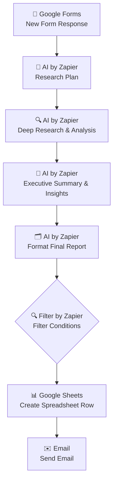

#  AI Research & Report Agent

> An AI-powered Zapier automation that transforms a simple research request into a fully structured, formatted report — planning the research approach, conducting deep analysis, summarizing key insights, formatting the final document, and delivering it via email and spreadsheet log, all through a chain of AI by Zapier steps.


---

##  Table of Contents

- [Project Overview](#-project-overview)
- [Workflow Diagram](#-workflow-diagram)
- [Features](#-features)
- [Technologies Used](#-technologies-used)
- [Folder Structure](#-folder-structure)
- [Setup Guide](#-setup-guide)
- [Use Cases](#-use-cases)
- [Screenshots](#-screenshots)
- [Troubleshooting](#-troubleshooting)
- [Best Practices](#-best-practices)
- [Contributing](#-contributing)
- [License](#-license)
- [Author](#-author)

---

##  Project Overview

Producing a well-researched, well-structured report typically takes hours of planning, investigation, synthesis, and formatting. **AI Research & Report Agent** compresses that process into a single automated pipeline — turning a submitted research request into a polished, delivered report using a sequence of four purpose-built AI steps.

Whenever a new research request is submitted via Google Forms, the workflow:

1. Captures the request (topic, scope, objectives) via **Google Forms**.
2. **Research Plan:** An AI by Zapier step outlines a structured research approach — key questions to answer and areas to investigate.
3. **Deep Research & Analysis:** A second AI step conducts the actual research and analysis based on that plan.
4. **Executive Summary & Insights:** A third AI step distills the research into a concise executive summary with key insights and takeaways.
5. **Format Final Report:** A fourth AI step assembles everything into a clean, structured final report.
6. **Filter by Zapier** checks that the report meets defined conditions (e.g., minimum length, required sections) before proceeding.
7. The finished report is logged to **Google Sheets** for record-keeping.
8. The report is delivered via **Email**, ready for the requester or team to review.

This project demonstrates how a multi-step AI reasoning chain — planning, researching, summarizing, and formatting — can automate a task that traditionally requires significant manual analytical work.

---

##  Workflow Diagram



A detailed breakdown of each step and the reasoning behind this design is available in [`docs/workflow-diagram.md`](docs/workflow-diagram.md).

---

##  Features

- **Structured Research Planning** — An initial AI step outlines a clear research approach before any actual analysis begins, improving the relevance and coverage of later steps.
- **Multi-Stage AI Reasoning Chain** — Four distinct AI by Zapier steps (Plan → Research → Summarize → Format) each handle one part of the analytical process, rather than relying on a single, overloaded AI call.
- **Executive-Ready Summaries** — A dedicated summarization step distills deep research into concise, decision-ready insights.
- **Consistent Report Formatting** — A final formatting step ensures every report follows the same clean, professional structure regardless of topic.
- **Quality Gate via Filter** — A Filter by Zapier step ensures only reports meeting defined criteria continue to logging and delivery, preventing incomplete or malformed reports from being sent out.
- **Automatic Archiving** — Every completed report is logged to Google Sheets, creating a searchable historical record of past research requests and outputs.
- **Automatic Delivery** — Finished reports are emailed out automatically, with no manual copy-pasting or file attachment required.
- **Fully No-Code** — Built entirely in Zapier, making a sophisticated research pipeline easy to inspect, adjust, and hand off to non-technical team members.

---

##  Technologies Used

| Tool / Service | Role in Workflow |
|---|---|
| **Zapier** | Core automation/orchestration platform |
| **Google Forms** | Research request intake (trigger) |
| **AI by Zapier** | Powers all four reasoning steps: Research Plan, Deep Research & Analysis, Executive Summary & Insights, Format Final Report |
| **Filter by Zapier** | Quality gate ensuring only qualifying reports proceed to logging and delivery |
| **Google Sheets** | Archival log of completed research reports |
| **Email** | Delivers the finished report to the requester or team |

---

## Folder Structure

```
ai-research-report-agent/
│
├── README.md                     # Main project documentation (this file)
├── LICENSE                       # MIT License
├── CONTRIBUTING.md               # Guidelines for contributing to this project
│
├── docs/
│   └── workflow-diagram.md       # Detailed step-by-step workflow breakdown
│
└── screenshots/
    └── README.md                 # Index/placeholder for workflow & setup screenshots
```

> **Note:** As this is a Zapier-based automation (not a code application), the repository is documentation-first — structured to showcase design decisions and configuration clearly, the same way source files showcase logic in a coded project.

---

##  Setup Guide

Follow these steps to recreate this automation in your own Zapier account.

### Prerequisites

- A Zapier account (a paid plan may be required for multiple AI by Zapier steps and Filter usage)
- A Google Forms form set up to capture research requests (e.g., topic, scope, intended audience, deadline)
- A Google Sheets spreadsheet prepared for logging completed reports
- A connected email account for report delivery

### Step-by-Step Configuration

**1. Trigger — Google Forms: New Form Response**
   - App: `Google Forms`
   - Trigger event: `New Form Response`
   - Select the form used to capture research requests.

**2. Action — AI by Zapier: Research Plan**
   - App: `AI by Zapier`
   - Prompt the AI to act as a research strategist: given the topic and scope from Step 1, outline the key questions to answer and the structure the research should follow.

**3. Action — AI by Zapier: Deep Research & Analysis**
   - App: `AI by Zapier`
   - Prompt the AI to conduct the actual research and analysis, using the research plan from Step 2 as its guide, and to synthesize findings on each identified question.

**4. Action — AI by Zapier: Executive Summary & Insights**
   - App: `AI by Zapier`
   - Prompt the AI to distill the research and analysis from Step 3 into a concise executive summary, highlighting the most important insights and takeaways.

**5. Action — AI by Zapier: Format Final Report**
   - App: `AI by Zapier`
   - Prompt the AI to assemble the research plan, deep analysis, and executive summary into one clean, well-structured final report with consistent headings and formatting.

**6. Filter — Filter by Zapier: Filter Conditions**
   - App: `Filter by Zapier`
   - Define conditions the final report must meet to proceed (e.g., minimum character/word count, presence of required section headers, non-empty summary field).

**7. Action — Google Sheets: Create Spreadsheet Row**
   - App: `Google Sheets`
   - Action event: `Create Spreadsheet Row`
   - Log the request details, timestamp, and final report content (or a link/summary of it) to your archive spreadsheet.

**8. Action — Email: Send Email**
   - App: `Email`
   - Action event: `Send Outbound Email`
   - Map the formatted final report from Step 5 into the email body, and send it to the original requester or a designated team address.

### Testing the Zap

1. Turn the Zap on in Zapier.
2. Submit a test research request through your Google Form.
3. Confirm for each test:
   - The Research Plan step produces a sensible, structured outline.
   - The Deep Research & Analysis step returns relevant findings based on that plan.
   - The Executive Summary step condenses findings into clear, high-level insights.
   - The Format Final Report step assembles everything into a clean, readable report.
   - The Filter step correctly allows qualifying reports through (and blocks incomplete ones).
   - A row is logged in Google Sheets and the report email is delivered successfully.

---

##  Use Cases

- **Freelance Consultants** — Deliver fast, structured research reports to clients without spending hours on manual analysis and formatting.
- **Market Researchers & Analysts** — Automate first-pass research and summarization for topics, competitors, or trends before deeper human review.
- **Business Owners** — Get quick, digestible research briefs on topics relevant to strategic decisions without hiring a dedicated analyst.
- **Students & Academics** — Generate structured research outlines and summaries as a starting point for deeper independent study.
- **Content & Marketing Teams** — Produce background research reports to inform content strategy, campaigns, or product positioning.

---

##  Screenshots

Screenshots of the live Zap configuration and sample outputs are organized in the [`screenshots/`](screenshots/) folder.

| Screenshot | Description |
|---|---|
| `01-zap-overview.png` | Full 8-step Zap overview in Zapier |
| `02-forms-trigger-config.png` | Google Forms "New Form Response" trigger configuration |
| `03-research-plan-config.png` | AI by Zapier — Research Plan step configuration |
| `04-deep-research-config.png` | AI by Zapier — Deep Research & Analysis step configuration |
| `05-executive-summary-config.png` | AI by Zapier — Executive Summary & Insights step configuration |
| `06-format-report-config.png` | AI by Zapier — Format Final Report step configuration |
| `07-filter-conditions.png` | Filter by Zapier condition setup |
| `08-sheets-log.png` | Sample logged report entry in Google Sheets |
| `09-report-email.png` | Sample final report delivered via email |

> Add your actual screenshots to the `screenshots/` folder using the filenames above, or update the table to match your naming convention.

---
** Troubleshooting

| Issue | Likely Cause | Solution |
|---|---|---|
| Zap doesn't trigger on new form submissions | Google Forms not properly connected, or wrong form selected | Reconnect Google Forms in Zapier and confirm the correct form is selected |
| Research Plan output is too vague | Prompt lacks clear instructions on structure or depth | Refine the prompt to request a specific number of research questions or sections |
| Deep Research step ignores the plan from Step 2 | Research plan output not correctly mapped into Step 3's prompt | Verify the field mapping between the Research Plan and Deep Research steps |
| Executive Summary misses key points | Summary prompt too generic, or full research context not passed in | Update the prompt to reference the full Deep Research output and explicitly request the top 3–5 insights |
| Final report formatting is inconsistent | Format step's prompt doesn't specify a fixed structure/template | Add an explicit output template to the prompt (e.g., required headings in a set order) |
| Filter blocks reports that should pass | Filter condition thresholds too strict, or referencing the wrong field | Review and adjust the Filter conditions against real report samples |
| Report never reaches Sheets or Email | Filter condition too strict and blocking valid reports | Loosen or correct the Filter conditions; test with a report that should clearly pass |
| Email fails to send | Email account disconnected, or recipient field not mapped | Reconnect the Email integration in Zapier and confirm the "To" field is mapped correctly |

---

##  Best Practices

- **Give each AI step a single, clear job.** Keep "planning," "researching," "summarizing," and "formatting" as separate steps so each prompt stays focused and produces more reliable output.
- **Pass full context between steps.** Make sure each AI step receives the relevant output from the previous step, not just the original form submission, so the chain builds coherently.
- **Enforce a consistent report template.** Specify exact section headings and order in the Format Final Report prompt so every report has a predictable, professional structure.
- **Set meaningful Filter conditions.** Base your Filter step on measurable criteria (length, required sections, non-empty fields) rather than subjective quality judgments that are hard to automate reliably.
- **Review Filter blocks periodically.** Check reports that get blocked by the Filter step to ensure the conditions aren't too strict (rejecting good reports) or too loose (letting weak ones through).
- **Archive everything.** Logging every completed report to Google Sheets — not just ones that pass the filter — can help you audit and improve the pipeline over time.
- **Monitor AI and task usage.** Four sequential AI by Zapier calls per request adds up — keep an eye on your Zapier task consumption and any associated AI usage limits.

---

##  Contributing

Contributions, suggestions, and improvements are welcome! Please see [CONTRIBUTING.md](CONTRIBUTING.md) for guidelines on how to propose changes, report issues, or suggest new features for this automation.

---

##  License

This project is licensed under the [MIT License](LICENSE) — feel free to use, modify, and adapt this workflow for your own projects.

---

##  Author

**AI SmartGalaxy (https://aismartgalaxy.com/)**
Automation Builder | Zapier & AI-Powered Workflow Enthusiast

This project is part of an ongoing portfolio of no-code and AI-powered automation projects, showcasing practical business use cases built with Zapier — from beginner-level integrations to advanced, multi-step AI reasoning pipelines.

- Open to freelance automation projects and collaborations
- 🔗 Feel free to connect for questions, feedback, or automation consulting

---

 **If you found this project useful or inspiring, consider starring the repository!**
